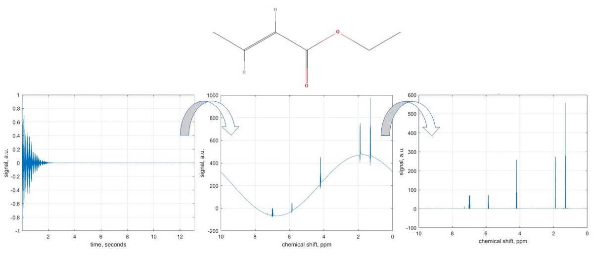

## 3. Error correction in NMR  

Radiofrequency hardware used to record NMR spectra is not perfect; its principal non-ideality is finite response time: resonant circuits operating at NMR frequencies (hundreds of MHz) take a few microseconds to switch between transmit and receive modes. This introduces three types of distortions: Baseline error, Frequency-independent phase error, and Frequency-dependent phase error. 
In this example, we will learn how to correct all three types of distortions. The molecule we are dealing with here is ethyl crotonate, a plasticiser for acrylic resins; we will be looking at its proton NMR spectrum. Data kindly provided by Prof. Ilya Kuprov, University of Southampton.

### Usage

This code can be opened in [MATLAB® Online™](https://matlab.mathworks.com/).

